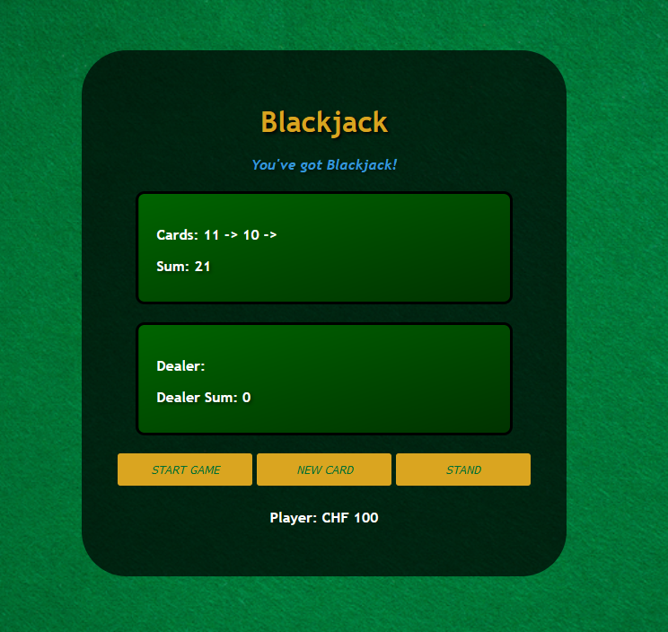

# Blackjack Game

Welcome to the Blackjack game! This project is a simple implementation of the classic card game using HTML, CSS, and JavaScript.

## Demo
Try it out: https://tubular-kitten-71833e.netlify.app/

## How to Use
- "Create New Game": Starts the game with 2 cards
- "New Card": Draw a new card
- "Stand": Keep current hand and don't draw any additional cards. The Dealer will start drawing cards until 17

